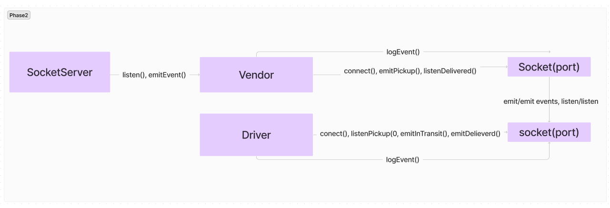
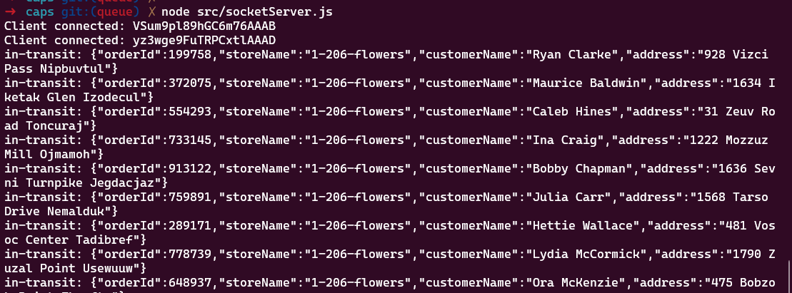
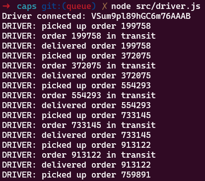
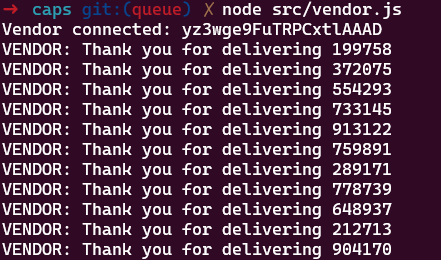
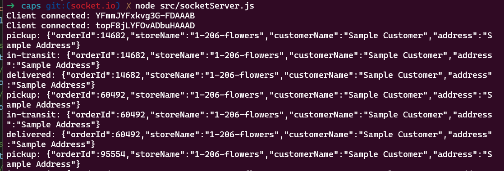
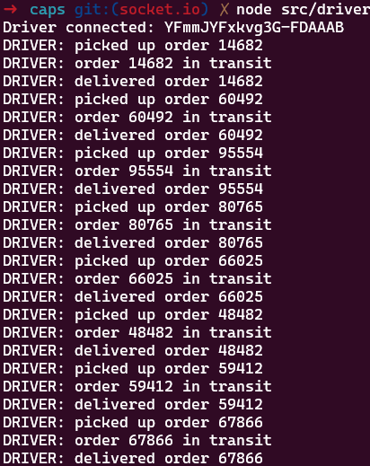
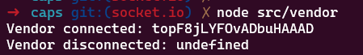
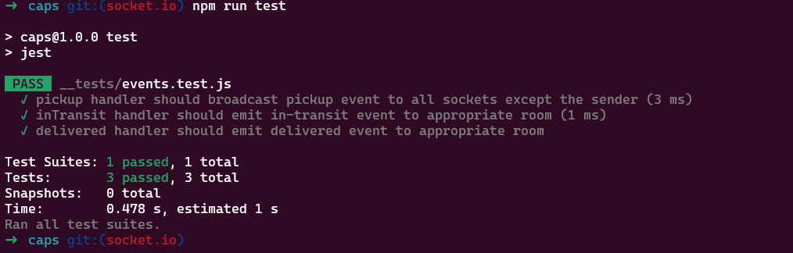
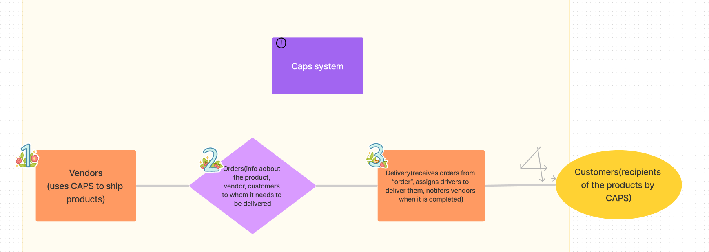

# caps

CAPS Phase 3: Complete work on a multi-day build of our delivery tracking system, adding queued delivery.

In this phase, we are going to implement a system to guarantee that notification payloads are read by their intended subscriber. Rather than just triggering an event notification and hope that client applications respond, we’re going to implement a “Queue” system so that nothing gets lost. Every event sent will be logged and held onto by the server until the intended recipient acknowledges that they received the message. At any time, a subscriber can get all of the messages they might have missed.

-[class 13 instructor README](https://github.com/codefellows/seattle-javascript-401d58/tree/main/class-123)

-[Github action link](https://github.com/QILINXIE02/caps/actions)

-[PR to main](https://github.com/QILINXIE02/caps/pull/5)

UML diagram: 

hub server:  
driver server: 
vendor server: 

================

CAPS Phase 2: Continue working on a multi-day build of our delivery tracking system, creating an event observable over a network with Socket.io.

In this phase, we’ll be moving away from using Node Events for managing a pool of events, instead refactoring to using the Socket.io libraries. This allows communication between Server and Client applications.

The intent here is to build the data services that would drive a suite of applications where we can see pickups and deliveries in real-time.

-[class 12 instructor README](https://github.com/codefellows/seattle-javascript-401d58/tree/main/class-12)

-[Github action link](https://github.com/QILINXIE02/caps/actions)

-[PR to main](https://github.com/QILINXIE02/caps/pull/3)

UML diagram: 

node src/socketServer.js: 
node src/driver.js: 
node src/vendor.js: 

test: 

====================

CAPS Phase 1: Begin the build of an application for a product called CAPS - The Code Academy Parcel Service. 

Code Academy Parcel Service (CAPS)
A real-time service that allows for vendors, such as flower shops or restaurants, to alert a system of a package needing to be delivered, for drivers to instantly see what’s in their pickup queue, and then to alert the vendors as to the state of the deliveries (in transit, and then delivered).

-[class 11 instructor README](https://github.com/codefellows/seattle-javascript-401d58/tree/main/class-11)

-[Github action link](https://github.com/QILINXIE02/caps/actions)

-[PR to main](https://github.com/QILINXIE02/caps/pull/1)

UML diagram:
